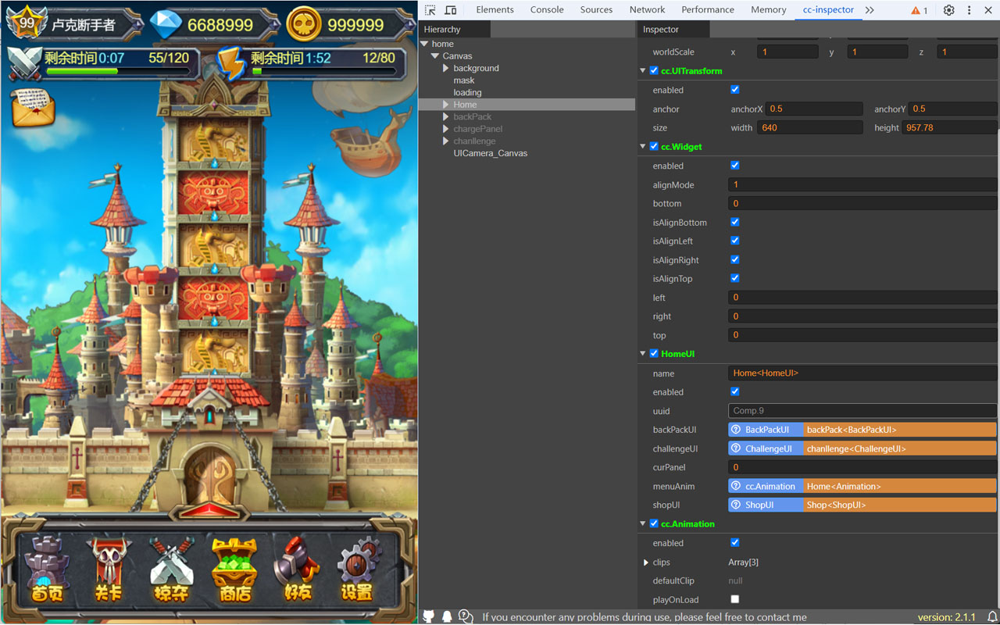

# cc-inspector-chrome

在浏览器中查看CocosCreator游戏的节点树、节点属性。

- [youtube](https://www.youtube.com/watch?v=ajMz3zEFTA8)
- [chrome](https://chromewebstore.google.com/detail/cc-inspector/hejbkamkfnkifppoaljcidepkhgaahcj?hl=zh-CN&utm_source=ext_sidebar)
- [bilibili](https://www.bilibili.com/video/BV1jzcHeSEh3/)
- [cocos store](https://store.cocos.com/app/detail/2002)
- [github](https://github.com/tidys/cc-inspector-chrome)

 
### 论坛
 - http://forum.cocos.com/t/chrome-creator/55669
 - https://forum.cocos.org/t/topic/164888

 
## 开发中使用到的技术
- [cc-plugin](https://www.npmjs.com/package/cc-plugin)
- [cc-ui](https://www.npmjs.com/package/@xuyanfeng/cc-ui)
- chrome 插件开发
- vue3、webpack
- cocos creator

## Cocos Creator Test Cases
 - [cocos test cases](https://tidys.github.io/creator-test-cases/)
 
## TODO
- 目前开发过程中无法实现HMR，参考[extensions-reloader](https://chrome.google.com/webstore/detail/extensions-reloader/fimgfedafeadlieiabdeeaodndnlbhid?utm_source=chrome-ntp-icon)
